# PetCare (iOS)

PetCare is an iOS app for managing household pets: profiles, health logs (including medication schedules and weight tracking), reminders with local notifications, nearby vet discovery on a map, and an in-app AI helper that can summarize pet health context.

## Features

- 🔐 Authentication
  - Email/password sign-in
  - Google Sign-In
- 👨‍👩‍👧‍👦 Households
  - Create a household
  - Join with a 6-character join code
  - Leave household
- 🐾 Pets
  - Add/edit pet profiles (photo, basic info)
  - Store pets under a household
- 🩺 Health Logs
  - Generic logs (checkups, vaccines, notes)
  - Medication logs (dose times, duration, reminders)
  - Weight tracking + trend visualization
- 🔔 Reminders & Notifications
  - Upcoming reminders on the Home screen
  - Local notifications scheduled from health logs
  - Live sync: Firestore changes update notifications automatically
- 📅 Calendar Integration (EventKit)
  - Add medication schedules and important reminders to the user’s calendar
- 🗺️ Nearby Vets
  - Map-based search using MapKit around your location
- 🤖 AI Helper
  - Builds a “pets + logs” context prompt
  - Answers pet-care questions with safety guardrails
- 🎨 Themes
  - System / Light / Dark theme switching

<h2>Screenshots</h2>

  <em>
    The screenshots below show the main user flow: onboarding → auth → home dashboard → pet details (meds/weight) →
    health logs & reminders → calendar (EventKit) → nearby vets (MapKit) → AI assistant → profile.
  </em>

<!-- Row 1 -->

  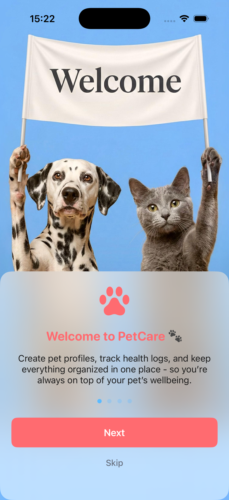
  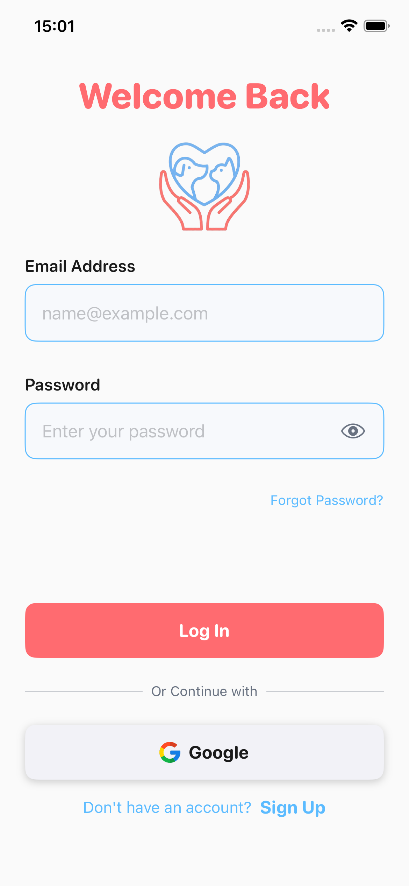
  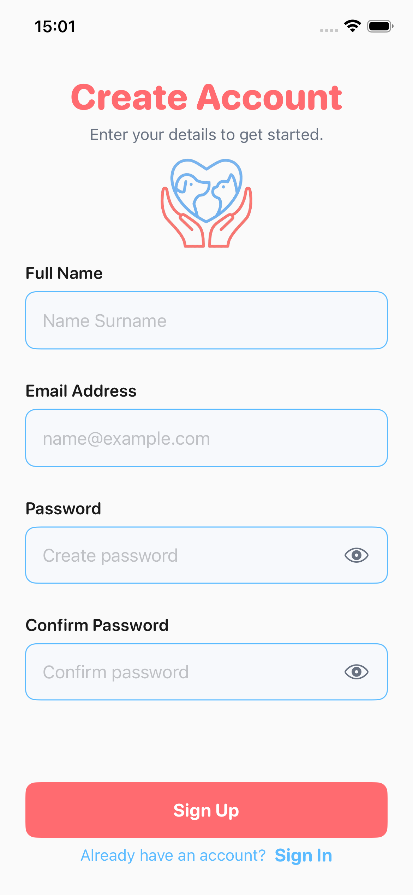

<!-- Row 2 -->

  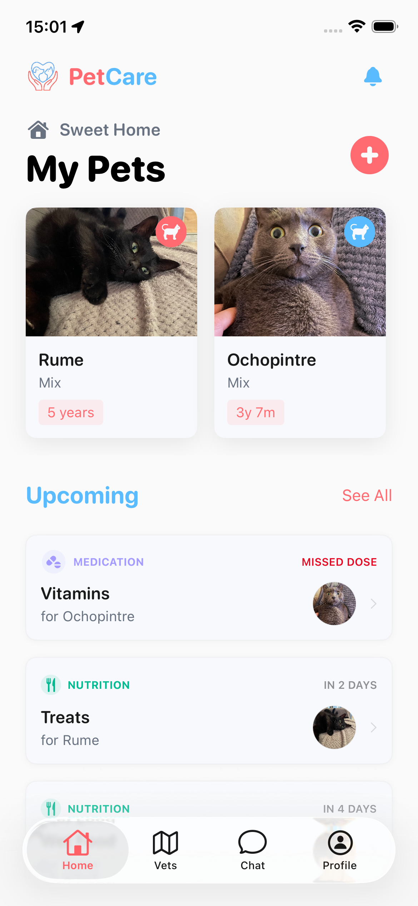
  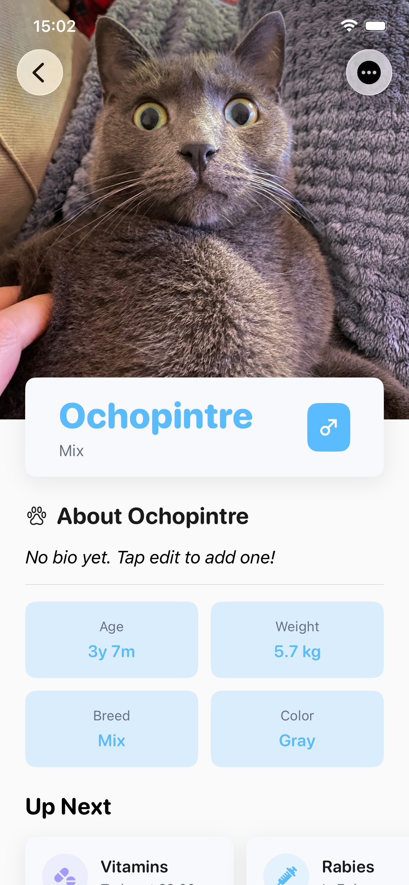
  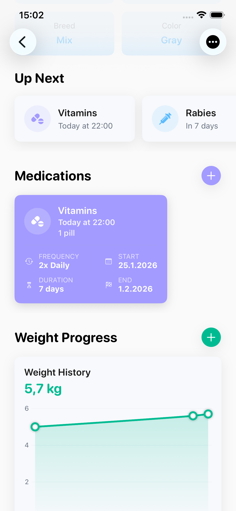

<!-- Row 3 -->

  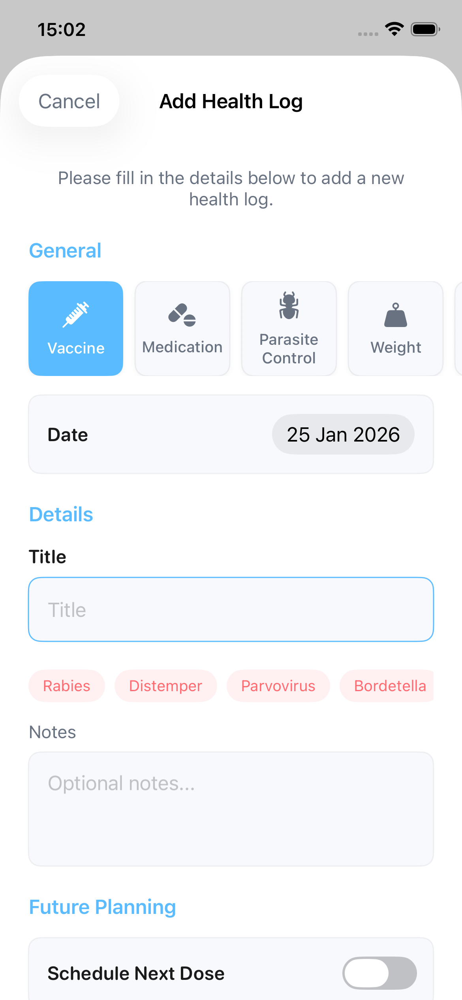
  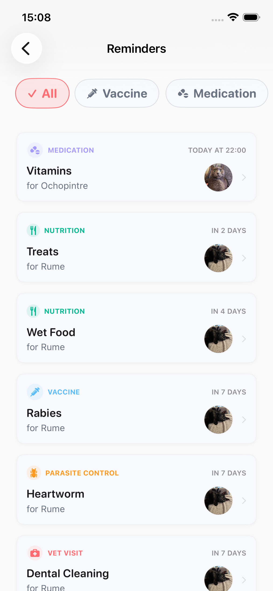
  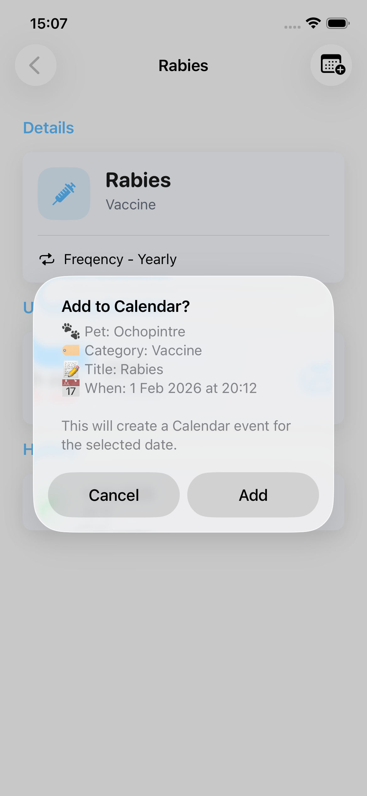

<!-- Row 4 -->

  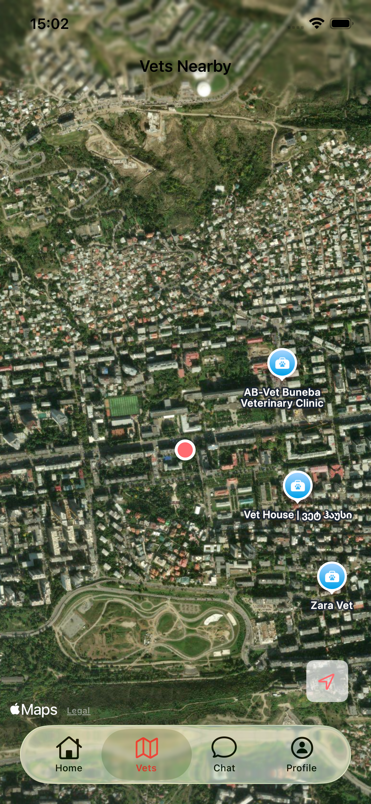
  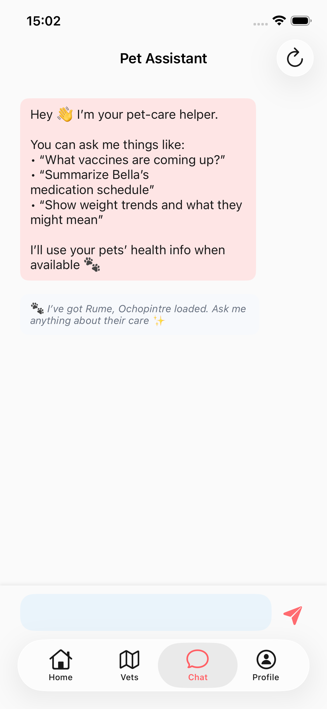
  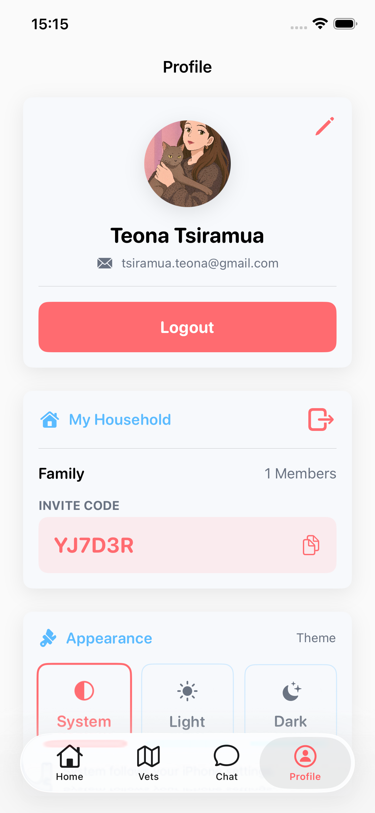

## Tech Stack

- Swift + SwiftUI + UIKit
- Combine + async/await
- Firebase
  - Auth
  - Firestore
  - Storage
  - Firebase AI Logic (Gemini)
- MapKit + CoreLocation
- UserNotifications
- EventKit (add reminders/events to Calendar)
- Swift Testing (`Testing` framework) + mocks

## Architecture

- **Coordinator pattern** drives app flows:
  - Onboarding → Auth → Main Tabs
- **MVVM** per feature:
  - Views are mostly SwiftUI
  - ViewModels hold state + async logic
- **Services behind protocols** for testability:
  - `AuthServiceProtocol`, `UserServiceProtocol`, `PetServiceProtocol`, etc.
- **Dependency Injection**:
  - `AppDIContainer` builds services and ViewModels

## Data Model (Firestore)

Collections used:
- `users/{userId}`
  - `householdId`, `fullName`, `photoUrl`, etc.
- `households/{householdId}`
  - `joinCode`, `adminId`, `memberIds`, etc.
- `pets/{petId}`
  - `householdId`, pet info, optional `photoUrl`
  - subcollection: `healthLogs/{logId}`

## Project Structure

- `App/` - Coordinators, app lifecycle, DI container
- `Features/` - UI + ViewModels grouped by feature
- `Models/` - Core domain models (Pet, HealthLog, Household, etc.)
- `Services/` - Firebase + system services (Auth, Firestore, Notifications, Map, AI)
- `Common/` - shared UI components, helpers, extensions
- `PetCareAppTests/` - unit tests + mocks

## Permissions

PetCare may request access to:
- Location (to find nearby vets)
- Notifications (to send reminders)
- Calendar (EventKit: to add schedules/reminders)

## Requirements
  
- Xcode 15+
- iOS 17.6 deployment target

## Getting Started

- Clone the repository
- Open `PetCareApp.xcodeproj` in Xcode
- Choose a simulator or connected device
- Run the app (`⌘R`)

## Running Tests

- In Xcode: Product → Test (⌘U)

